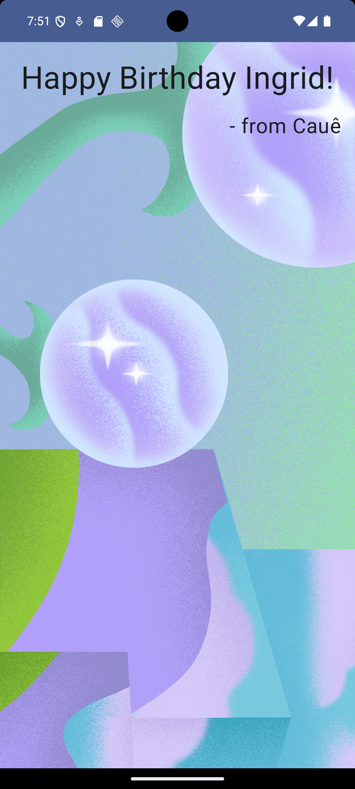

### 🎉 **Codelab - Happy Birthday**

Repositório dedicado ao codelab da Google **First App: Happy Birthday**. 

---
#### 📚 **Codelabs Incluídos**

- **Introdução à UI com Jetpack Compose:** Aprenda a criar interfaces modernas e declarativas utilizando o Jetpack Compose.
- **Adicionando Imagem ao App:** Descubra como incorporar imagens ao seu aplicativo para deixá-lo mais interativo e visualmente atraente.

#### 📱 Screenshot do App

  

#### Links Úteis
- [Codelab introdução a UI com jetpack compose](https://developer.android.com/codelabs/basic-android-kotlin-compose-text-composables?authuser=1&hl=pt-br&continue=https%3A%2F%2Fdeveloper.android.com%2Fcourses%2Fpathways%2Fandroid-basics-compose-unit-1-pathway-3%3Fauthuser%3D1%26hl%3Dpt-br%23codelab-https%3A%2F%2Fdeveloper.android.com%2Fcodelabs%2Fbasic-android-kotlin-compose-text-composables#0)
- [Codelab adicionando imagem ao APP](https://developer.android.com/codelabs/basic-android-kotlin-compose-add-images?authuser=1&hl=pt-br&continue=https%3A%2F%2Fdeveloper.android.com%2Fcourses%2Fpathways%2Fandroid-basics-compose-unit-1-pathway-3%3Fhl%3Dpt-br%26authuser%3D1%23codelab-https%3A%2F%2Fdeveloper.android.com%2Fcodelabs%2Fbasic-android-kotlin-compose-add-images#0)
